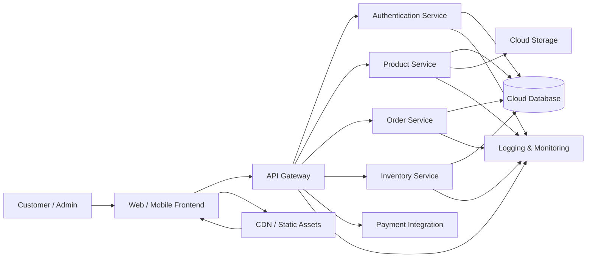

# Scalable Herbal Marketplace Infrastructure

## Overview

This project is focused on building a scalable cloud-based infrastructure for a herbal marketplace system, with an emphasis on performance, modular architecture, and secure data handling.

## Features

* Modular backend services for product and user management
* Well-structured APIs for seamless communication between components
* Scalable architecture designed for future growth and performance
* Secure data handling practices to support reliability and trust

## Tech Stack

* C++ — Data Structures & Algorithms, problem-solving, and logic optimization
* Python — backend development and scripting
* Git & GitHub — version control, collaboration, and project management

## System Design (High-Level)

### Architecture Overview

* **Frontend Layer:** Provides a clean interface for customers and admins to browse products, manage orders, and track activity.
* **API Gateway:** Acts as the single entry point for all client requests and routes them to the appropriate backend service.
* **Microservices Layer:** Separate services for authentication, products, orders, and inventory ensure modularity, scalability, and easier maintenance.
* **Database Layer:** Stores structured application data securely in a cloud-hosted relational database.
* **Cloud Storage:** Handles product images and other static assets efficiently.
* **Monitoring & Logging:** Tracks system health, request flow, and errors to improve reliability and debugging.

### Design Goals

* **Scalability:** Designed to support independent scaling of services based on workload and demand.
* **Security:** Implements centralized authentication and secure data handling practices.
* **Maintainability:** Follows a modular architecture to simplify feature updates, testing, and debugging.
* **Performance:** Optimized with efficient routing, caching, and cloud storage for faster response times.

## Future Improvements

* Implement authentication and authorization for secure user access
* Optimize load handling to improve scalability and performance
* Add database indexing to enhance query efficiency
* Integrate logging and monitoring for better observability and debugging

## Author

Tuhina Bhaduri

